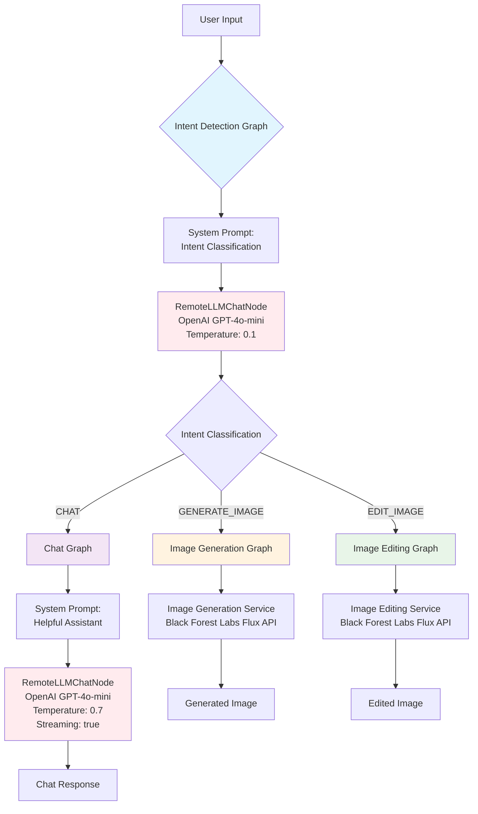

# Intent-Based Routing Chat Application

A minimal intent-based routing chat application built with Inworld Runtime, featuring three core AI services: text chatbot, image generation, and image editing. This application demonstrates a graph-based architecture for intelligent request routing using Inworld Runtime's graph primitives.

## Architecture Overview

Our application uses a modular graph-based architecture inspired by [Inworld's runtime-chat-with-docs](https://github.com/inworld-ai/runtime-chat-with-docs/tree/main) demo. The system routes user requests through specialized graphs:



### Graph Components

#### 1. Intent Detection Graph ✅
- **Purpose**: Classifies user input into CHAT, GENERATE_IMAGE, or EDIT_IMAGE
- **Architecture**: `RemoteLLMChatNode` with classification prompt
- **Configuration**: Low temperature (0.1) for consistent classification
- **Output**: JSON with intent, confidence, and reasoning
- **Test Results**: 93-98% accuracy across all intent types

#### 2. Chat Graph ✅
- **Purpose**: Handles general conversation
- **Architecture**: `RemoteLLMChatNode` with conversation history
- **Configuration**: Higher temperature (0.7) for creative responses, streaming enabled
- **Features**: Maintains conversation context, session management

#### 3. Image Generation Graph 🔄
- **Purpose**: Creates new images from text descriptions
- **Integration**: Black Forest Labs Flux API
- **Input**: Text prompts extracted from user intent

#### 4. Image Editing Graph 🔄
- **Purpose**: Modifies existing images based on instructions
- **Integration**: Black Forest Labs Flux API  
- **Input**: Images + editing instructions

## Quick Start

```bash
# Install server dependencies
cd server
npm install

# Install client dependencies  
cd ../client
npm install

# Set up environment variables
cd ../server
cp .env.example .env
# Add your INWORLD_API_KEY to .env

# Start the server
npm run dev

# In another terminal, start the client
cd ../client
npm start
```

## Environment Variables

```env
# server/.env
INWORLD_API_KEY=your_inworld_api_key
PORT=3001
NODE_ENV=development
CORS_ORIGIN=http://localhost:3000

# Optional for image services (when implemented)
FLUX_API_KEY=your_flux_api_key
```

## Testing

We maintain comprehensive tests to ensure reliability:

```bash
# Run all tests
cd server
npm test

# Run tests with coverage
npm run test:coverage

# Run tests in watch mode
npm run test:watch

# Test the graph execution directly
npm run test:graph
```

**Test Coverage:**
- ✅ Intent Detection: All three intent types with various inputs
- ✅ Graph Execution: Direct graph testing with live API
- ✅ API Endpoints: Integration tests for all routes
- 🔄 Image Services: Tests planned for Flux API integration

## Usage Examples

**Intent Detection Results:**
```bash
# Chat Intent
"Hello, how are you?" → chat (95% confidence)

# Image Generation Intent  
"Generate an image of a sunset" → generate-image (98% confidence)

# Image Editing Intent
"Make this photo brighter" → edit-image (93% confidence)
```

## Project Structure

```
server/
├── src/
│   ├── graphs/           # Graph definitions (NEW!)
│   │   ├── intent-detection.graph.ts
│   │   ├── chat.graph.ts
│   │   └── image.graphs.ts (planned)
│   ├── services/         # Service implementations
│   │   ├── intent-detection.service.ts
│   │   └── chat-service.ts
│   ├── routes/           # API endpoints
│   │   ├── chat.ts
│   │   ├── health.ts
│   │   └── test.ts
│   ├── utils/            # Utilities
│   │   ├── logger.ts
│   │   └── error-handler.ts
│   ├── types/            # TypeScript definitions
│   ├── config/           # Configuration
│   └── __tests__/        # Test suite
├── jest.config.js
├── package.json
└── .env

client/
├── src/
│   ├── components/
│   └── services/
├── package.json
└── public/
```

## Development

### Graph-Based Architecture Benefits

1. **Modularity**: Each graph handles a specific concern
2. **Reusability**: Graphs can be composed and reused
3. **Testability**: Individual graph components can be tested in isolation
4. **Scalability**: Easy to add new graphs for additional services
5. **Maintainability**: Clear separation between intent detection, chat, and image services

### Adding New Graphs

Following the [runtime-chat-with-docs](https://github.com/inworld-ai/runtime-chat-with-docs/tree/main) pattern:

1. Create new graph class in `src/graphs/`
2. Define configuration interface
3. Implement `build()`, `execute()`, and `destroy()` methods
4. Add corresponding service integration
5. Update intent detection if needed

### Key Lessons Learned

- Use `provider: 'openai'` with `modelName: 'gpt-4o-mini'` for reliable LLM access
- `graph.start()` returns `GraphOutputStream` directly, not `{outputStream}`
- Low temperature (0.1) for classification, higher (0.7) for creative responses
- Comprehensive testing prevents regression during development

## Tech Stack

- **Backend**: Node.js, Express, TypeScript
- **Frontend**: HTML, CSS, JavaScript (TypeScript)
- **AI Runtime**: Inworld Runtime (@inworld/runtime) v0.5.2
- **Graph Architecture**: RemoteLLMChatNode, GraphBuilder patterns
- **Image Services**: Black Forest Labs Flux API (planned)
- **Testing**: Jest with supertest, integration tests
- **Logging**: Winston with structured logging

## Contributing

This project showcases Inworld Runtime's graph-based architecture. The codebase is designed to be:
- **Educational**: Clear examples of graph patterns
- **Extensible**: Easy to add new services and intents
- **Production-Ready**: Proper error handling, logging, and testing

## Feedback

We maintain detailed feedback for the Inworld Runtime team in `inworld-runtime-feedback.md`, documenting:
- Issues encountered and resolutions
- API improvements and suggestions  
- Working code patterns and best practices

## License

MIT