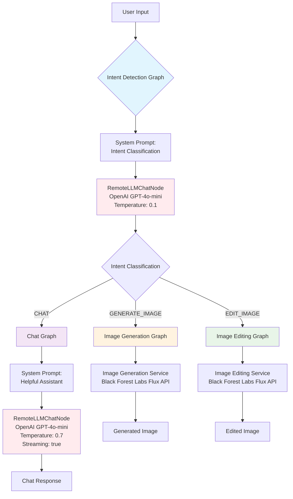

# Intent-Based Routing Chat Application

An intent-based routing chat application built with Inworld Runtime, featuring text chatbot, image generation, and image editing services.

## Architecture

The application uses a modular graph-based architecture that routes user requests through specialized graphs:



### Graph Components

#### Intent Detection Graph
- Classifies user input into CHAT, GENERATE_IMAGE, or EDIT_IMAGE
- Uses `RemoteLLMChatNode` with low temperature (0.1) for consistent classification
- Returns JSON with intent, confidence, and reasoning

#### Chat Graph
- Handles general conversation with conversation history
- Uses `RemoteLLMChatNode` with higher temperature (0.7) for creative responses
- Supports streaming responses

#### Image Generation Graph
- Creates images from text descriptions
- Integrates with Black Forest Labs Flux API
- Includes LLM prompt enhancement and session tracking

#### Image Editing Graph
- Modifies existing images based on natural language instructions
- Context-aware targeting ("edit the last image")
- References previously generated/uploaded images

## Quick Start

### Prerequisites
- Node.js 18+
- [Inworld API Key](https://platform.inworld.ai) (required)
- [Flux API Key](https://api.bfl.ai) (optional - has mock mode)

### Setup
```bash
# Clone and install
git clone <repository-url>
cd runtime-intent-based-router
cd server && npm install
cd ../client && npm install

# Configure environment
cd server
cp env.example.complete .env
# Edit .env: Set INWORLD_API_KEY=your_key_here

# Start application
# Terminal 1: Server
npm run dev

# Terminal 2: Client
cd ../client
npm start
```

Open http://localhost:3000 and try:
- "Hello there!" (chat)
- "Generate a sunset image" (image generation)
- "Edit the last image to be brighter" (image editing)

## Configuration

### Required Environment Variables
```env
INWORLD_API_KEY=your_key_here
PORT=3001
NODE_ENV=development
CORS_ORIGIN=http://localhost:3000
```

### Optional Variables
```env
# Flux API for real image generation
FLUX_API_KEY=your_flux_key_here
FLUX_USE_MOCK=true  # Keep true for development (no API costs)

# OpenAI override (uses Inworld key by default)
OPENAI_API_KEY=sk-...
```

See [env.example.complete](env.example.complete) for all configuration options.

## Testing

```bash
cd server

# Run all tests
npm test

# Run specific tests
npm test -- --testPathPattern="image-generation.service.test.ts"
npm test -- --testPathPattern="intent-detection.service.test.ts"

# Coverage
npm run test:coverage
```

## Project Structure

```
/
├── server/                    # Backend API
│   ├── src/
│   │   ├── graphs/           # AI Graph Definitions
│   │   │   ├── intent-detection.graph.ts
│   │   │   ├── chat.graph.ts
│   │   │   ├── image-generation.graph.ts
│   │   │   └── image-editing.graph.ts
│   │   ├── services/         # Business Logic
│   │   │   ├── intent-detection.service.ts
│   │   │   ├── chat-service.ts
│   │   │   ├── image-generation.service.ts
│   │   │   ├── image-editing.service.ts
│   │   │   ├── session-manager.service.ts
│   │   │   ├── flux-api.service.ts
│   │   │   └── flux-mock.service.ts
│   │   ├── routes/           # API Endpoints
│   │   │   ├── unified-chat.ts
│   │   │   ├── image-upload.ts
│   │   │   ├── health.ts
│   │   │   └── test.ts
│   │   ├── config/           # Configuration System
│   │   ├── types/            # TypeScript Definitions
│   │   ├── utils/            # Utilities
│   │   └── __tests__/        # Test Suite
│   ├── logs/                 # Application logs
│   ├── uploads/              # Image storage
│   └── .env                  # Environment config
├── client/                   # Frontend
│   ├── public/
│   └── package.json
└── env.example.complete      # Configuration template
```

## Troubleshooting

### Common Issues

**Port already in use**
```bash
lsof -ti:3001 | xargs kill -9
```

**Cannot connect to Inworld API**
- Verify `INWORLD_API_KEY` is correct
- Check network connectivity

**402 Payment Required from Flux API**
- Set `FLUX_USE_MOCK=true` in `.env`

**Tests hanging**
- Tests use mock mode automatically
- Minor gRPC cleanup warnings are harmless

**TypeScript errors**
```bash
npm run build  # Should show 0 errors
```

### Development Tips
- Use mock mode (`FLUX_USE_MOCK=true`) during development
- Check logs in `server/logs/app.log`
- Client auto-refreshes, server needs restart for `.env` changes

## Tech Stack

- **Backend**: Node.js, Express, TypeScript
- **Frontend**: HTML, CSS, JavaScript
- **AI Runtime**: Inworld Runtime (@inworld/runtime) v0.5.2
- **Image Services**: Black Forest Labs Flux API
- **Testing**: Jest with supertest
- **Logging**: Winston

## License

MIT